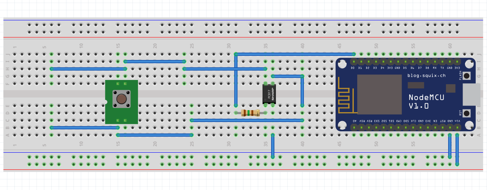

# espwol: A ESP Based WiFi WoL(technically not) solution

> This design is still a working progress,
although it's already up and running in my PC 👍 it's been great

## Contents

- [espwol: A ESP Based WiFi WoL(technically not) solution](#espwol--a-esp-based-wifi-wol-technically-not--solution)
  - [Contents](#contents)
  - [What is espwol?](#what-is-espwol-)
  - [Usage](#usage)
    - [Through POSTMAN](#through-postman)
    - [Through cURL](#through-curl)
  - [Hardware Design](#hardware-design)
    - [List of Components](#list-of-components)
    - [Schematics](#schematics)
    - [Wireing](#wireing)
  - [Software](#software)
  - [Contributing and TODO](#contributing-and-todo)

## What is espwol?

I wanted to connect to my home PC from work, which alweady has Windows RDC setup
and forwarded. However, I always find myself in the situation of forgetting to
power on my PC before I leave.  

WoL(Wake on LAN) is definitly a valid solution, I just need to send a magic
packet to my PC to turn it on but the issue is I do not have a `Ethernet`
connection to my PC, and WoL is almost imposible to do with `WiFi cards`.  

Instead of using the `WoL` feature of my motherboard, `espwol` uses a
WiFi connected `ESP8266 NodeMCU` to received post requests and activates
a solid state relay(Optocoupler) to short the power button, just like how
you would power on a PC at home.  

## Usage

To create the push request through the internet, you could assign a `static ip`
for the `ESP` through your router and `port forward` the `http` port `80` to
the internet.

**However, this is not recommended if you do not have authentication
set up, which is what is in place now.**

What I do is I connect through my server that has `OVPN` setup with proper
authentication and then I can send a post request to e.g.`192.168.0.100` just
like I'm at home.

### Through POSTMAN

I like to use `POSTMAN` to test my API's and its a easy way to send requests.


### Through cURL

```bash
curl -X POST http://192.168.0.100/push
```

## Hardware Design

The hardware of the solution is fiarly simple consisting of only 3 components,
of course, you need your jumpers, perfboards or fancy sockets if you want.

### List of Components

- NodeMCU v1.0 (Or any other ESP based chip, for example a ESP32)
- PC817 Optocoupler (4N25, 6N136, MOC3021, MOC3041, 6N137 could all work)
- 150Ω resistor

### Schematics

**The push button is not needed, its just there to repersent
the power button on your PC**




### Wireing

1. `+5V` and `GND` to `vin` and `GND` pin on ESP
2. `pin 1` of `PC817` to 150Ω resistor then `D0`(aka `GPIO16`)
3. `pin 2` of `PC817` to `GND`
4. connect whatever connector you like for the input and output pins,
i just used some standard two screw PCB termination blocks.

We also need two sets of connects from the PC to the ESP

1. Connect `GND` of powersupply to `GND` of ESP,
you can find a GND wire on the `24 pin`,`PCI-E`,`SATA` or
any kind of wire that comes out from your PSU, it's almost always a black one.

2. Connect `+5V` to the `vin` of ESP. To do this, you need the always on `+5v`
from your `24 pin` connector to the mother board, its the `purple` wire or pin `9`.

3. What I did was simply cut the `purple` wire on my `24 pin` atx connector and
spliced in a wire that goes into my ESP. For the grounding, I just used an
unused `SATA` connector.


## Software

The software of this design is very simple, I just need a server that connects
to my home WiFi and listens to `POST` requests on a endpoint. Since I will be
running this in my local network only, I didn't implement any security features,
but definitly a future TODO.  

The server is written using [aREST](https://github.com/marcoschwartz/aREST) by @ma
rcoschwartz which makes it super easy to create a endpiont to send requests.  

Theres only a couple of lines that I added to the boiler plate code of the library
to make it work.

I'm using `platform.io` through `VSCODE` but you can write the script in
`ArduinoIDE`; however, you you need to install the `aREST` library regardless.

```c
// Define powerbutton pin
#define POWER_BUTTON_PIN D0

int push(String command)
{
  digitalWrite(POWER_BUTTON_PIN, HIGH);
  Serial.println("Button Pushed...");
  delay(200);
  digitalWrite(POWER_BUTTON_PIN, LOW);
  return 1;
}

void setup(void)
{
...
// Initiate D0 as an output
pinMode(POWER_BUTTON_PIN, OUTPUT);

// Function to be exposed
rest.function("push", push);
...
}
```

[Full Code](main.cpp)

## Contributing and TODO

Please feel free to create a pull request if you want to add more features,
fix a bug or add anything. Here are some ideas that I want to implement:

- [ ] Add authentication and security to `POST`
- [ ] Intercept and measure computer power state
- [ ] Add another channel for `RESET` button
- [ ] Create a WebUI for managing post Requests and host it through the ESP
- [ ] Setup ESP `Watchdog` to save a bit of power
